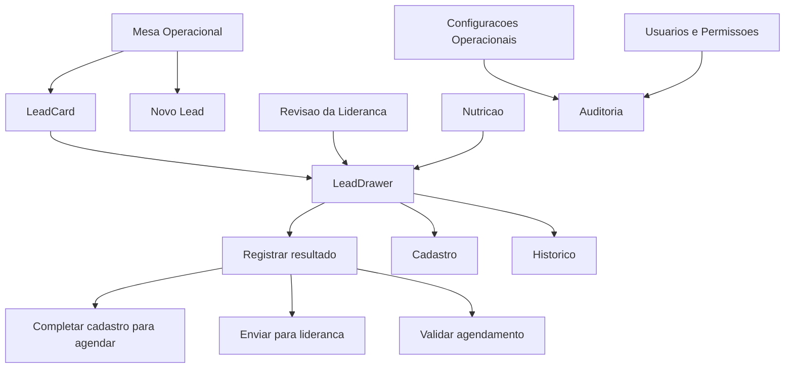

# Lead Operational UI Wireframes

Project: CRM Clube04 Mogi das Cruzes
Area: Product UX
Milestone: M2 - Mesa Operacional
Status: Draft for UI validation
Format: ASCII-only

---

## 1. Purpose

This document describes screen positioning and component composition for the Lead Operational module.

It must be read with:

- `docs/frontend/lead-operational-ui-contract.md`
- `docs/product/lead-operational-system.md`
- `docs/product/lead-operational-technical-contract.md`

Wireframes are structural references. The visual contract defines typography, colors, spacing and interaction details.

---

## 2. Navigation map



---

## 3. App shell - Desktop

```text
+----------------------------------------------------------------------------------+
| Sidebar                 | Header                                                  |
|                         | [Menu] Mesa Operacional       Visualizando como: Lider |
| Mesa Operacional        +---------------------------------------------------------+
| Novo Lead               |                                                         |
| Revisao da Lideranca    | Page content                                            |
| Nutricao                |                                                         |
| Configuracoes           |                                                         |
| Usuarios e Permissoes   |                                                         |
| Auditoria               |                                                         |
+----------------------------------------------------------------------------------+
```

Rules:

- Sidebar can collapse.
- Header remains visible.
- Header includes profile selector.
- Main content handles scroll.

---

## 4. Mesa Operacional - Desktop

```text
+------------------------------------------------------------------------------------------------+
| Mesa Operacional                                                        [+ Novo Lead]          |
| Operacao diaria dos leads de WhatsApp, agendamento, lideranca e nutricao.                      |
+------------------------------------------------------------------------------------------------+
| [Todos ativos] [Hoje] [Atrasados] [Backlog] [Prox. 7 dias] [Validar] [Lideranca] [Nutricao]   |
+------------------------------------------------------------------------------------------------+
|                                                                                                |
| +--------------------------+ +--------------------------+ +--------------------------+         |
| | Fazer follow-up       42 | | Validar agendamento   8  | | Revisar lideranca     5  |         |
| | Atendimento ativo        | | Confirmar desfecho       | | Excecoes e decisoes      |         |
| +--------------------------+ +--------------------------+ +--------------------------+         |
| | LeadCard                 | | LeadCard                 | | LeadCard                 |         |
| | LeadCard                 | | LeadCard                 | | LeadCard                 |         |
| | LeadCard                 | |                          | |                          |         |
| | LeadCard                 | |                          | |                          |         |
| +--------------------------+ +--------------------------+ +--------------------------+         |
|                                                                                                |
| +--------------------------------------------------------------------------------------------+ |
| | Nutricao recolhida 12 leads                                             [Abrir Nutricao]   | |
| +--------------------------------------------------------------------------------------------+ |
+------------------------------------------------------------------------------------------------+
```

Behavior:

- Lead terminal does not appear.
- Queue columns are based on action item/fila operacional.
- Nutricao is collapsed by default.
- `/nutricao` is the main nutrition view.

---

## 5. Mesa Operacional - Mobile

```text
+--------------------------------------+
| Mesa Operacional                     |
| Visualizando como: Atendente         |
+--------------------------------------+
| [Todos] [Hoje] [Atrasados] [Backlog] |
| [Prox. 7] [Lideranca] [Nutricao]     |
+--------------------------------------+
| Fila operacional                     |
| [Fazer follow-up              v]     |
+--------------------------------------+
| LeadCard                             |
+--------------------------------------+
| LeadCard                             |
+--------------------------------------+
| LeadCard                             |
+--------------------------------------+
```

Alternative with tabs:

```text
+--------------------------------------+
| [Follow-up] [Agend.] [Lider.] [Nut.] |
+--------------------------------------+
| LeadCard                             |
| LeadCard                             |
+--------------------------------------+
```

Do not render four columns side by side on mobile.

---

## 6. LeadCard - Normal

```text
+------------------------------------------------+
| Maria Souza                         Hoje       |
| Nina, Thor                                      |
| (11) 99999-0000      [WhatsApp] [Copiar]       |
| Prox.: hoje 16:30      SR 3/12   FU 5          |
| [Sem resposta] [Tentativa 3/12] [Banho]        |
| Ult.: Sem resposta                             |
| Obs.: pediu valores de banho e tosa            |
+------------------------------------------------+
```

Clickable behavior:

- Body opens drawer.
- WhatsApp opens `wa.me`.
- Copiar copies phone.
- Tags are not primary buttons.

---

## 7. LeadCard - Backlog / critical

```text
+------------------------------------------------+
| Carla Mendes                     Backlog 12d   |
| Bento                                          |
| (11) 98888-0000      [WhatsApp] [Copiar]       |
| Prox.: atrasado ha 12d  SR 10/12   FU 14       |
| [Sem resposta] [Tentativa 10/12] [Meta Ads]    |
| Ult.: Sem resposta                             |
| Obs.: lead frio, sem retorno desde D+6         |
+------------------------------------------------+
```

Rules:

- Backlog dominates primary situation.
- Tags show reason and attempt.
- Do not add multiple red badges.

---

## 8. LeadCard - Follow-up longo

```text
+------------------------------------------------+
| Ana Paula                      FU longo 10d    |
| Mel                                            |
| (11) 97777-0000      [WhatsApp] [Copiar]       |
| Prox.: 20/06 09:30     SR 1/12   FU 2          |
| [Follow-up longo] [Motivo informado] [Pacote]  |
| Ult.: Demonstrou interesse                     |
| Obs.: pediu para retomar apos viagem           |
+------------------------------------------------+
```

Drawer must show the reason.

---

## 9. LeadDrawer - Follow-up

```text
+------------------------------------------------------------+
| Maria Souza                                           [X]  |
| Nina, Thor                                                 |
| (11) 99999-0000              [WhatsApp] [Copiar]           |
| Fila: Fazer follow-up                                      |
| Proxima acao: Hoje 16:30          SR 3/12   FU 5           |
| [Hoje] [Sem resposta] [Tentativa 3/12]                     |
+------------------------------------------------------------+
| Acao principal                                             |
| Resultado do atendimento                                   |
| [Sem resposta                                      v]       |
|                                                            |
| Campos condicionais                                        |
| Proxima data: calculada pela cadencia                      |
| Observacao: [________________________________________]      |
|                                                            |
| [Registrar sem resposta] [Cancelar]                        |
+------------------------------------------------------------+
| [Resumo] [Historico] [Cadastro]                            |
+------------------------------------------------------------+
| Resumo                                                     |
| Origem: Meta Ads Instagram                                 |
| Responsavel: Atendente                                     |
| Ultima interacao: hoje 10:32                               |
| Observacao inicial: pediu valores de banho e tosa          |
+------------------------------------------------------------+
```

---

## 10. LeadDrawer - Follow-up with long date

```text
+------------------------------------------------------------+
| Resultado: Demonstrou interesse                            |
| Proxima data: [30/06/2026 09:30]                           |
|                                                            |
| ALERTA                                                     |
| Este follow-up esta acima do prazo normal para esta etapa. |
| Informe o motivo. A lideranca vera este alerta.            |
|                                                            |
| Motivo: [Tutor pediu retorno apos viagem_____________]      |
|                                                            |
| [Salvar proximo follow-up] [Cancelar]                      |
+------------------------------------------------------------+
```

If attendant selects date above 15 days:

```text
+------------------------------------------------------------+
| BLOQUEADO                                                  |
| Follow-up acima de 15 dias nao e permitido para atendente. |
| Envie para lideranca ou mova para Nutricao.                |
|                                                            |
| [Enviar para lideranca] [Ir para Nutricao] [Cancelar]      |
+------------------------------------------------------------+
```

---

## 11. LeadDrawer - Agendamento combinado

```text
+------------------------------------------------------------+
| Resultado: Agendamento combinado                           |
| Data do agendamento: [12/06/2026 10:00]                    |
| Servico previsto: [Banho v]                                |
|                                                            |
| [Registrar agendamento]                                    |
+------------------------------------------------------------+
| Modal abre: Completar cadastro para agendar                |
+------------------------------------------------------------+
```

---

## 12. Modal - Completar cadastro para agendar

```text
+------------------------------------------------------------+
| Completar cadastro para agendar                       [X]  |
+------------------------------------------------------------+
| Tutor                                                      |
| Nome completo: [____________________________]              |
| Data nascimento: [__/__/____] CPF: [____________]          |
| Email: [_____________________________________]             |
| CEP: [_________] Endereco: [__________________]            |
| Como conheceu: [Meta Ads v] Indicacao: [_______]           |
+------------------------------------------------------------+
| Doguinho                                                   |
| Nome: [________________]                                   |
| Tem raca definida? [Sim v] Raca: [___________]             |
| Peso aprox.: [____] Data/idade: [_____________]            |
| Castrado? [Sim v] Frequencia banho: [________]             |
| Saude/manejo: [____________________________________]       |
+------------------------------------------------------------+
| [Salvar cadastro] [Salvar incompleto] [Cancelar]           |
+------------------------------------------------------------+
```

If incomplete:

```text
Tag on card: [Cadastro incompleto]
Lead remains in fila: Validar agendamento
```

---

## 13. LeadDrawer - Validar agendamento

```text
+------------------------------------------------------------+
| Fila: Validar agendamento                                  |
| Agendamento: 12/06/2026 10:00                              |
+------------------------------------------------------------+
| Resultado da validacao                                     |
| ( ) Cliente compareceu                                     |
| ( ) Cliente nao compareceu                                 |
| ( ) Cancelou                                               |
| ( ) Remarcou                                               |
| ( ) Agendamento nao localizado                             |
| ( ) Erro operacional                                       |
|                                                            |
| Campos condicionais                                        |
| Observacao: [________________________________________]      |
| Nova data se remarcou: [__/__/____ __:__]                  |
|                                                            |
| [Registrar validacao] [Cancelar]                           |
+------------------------------------------------------------+
```

---

## 14. LeadDrawer - Enviar para lideranca

```text
+------------------------------------------------------------+
| Enviar para lideranca                                      |
+------------------------------------------------------------+
| Checklist                                                  |
| [ ] Houve tentativa real pelo WhatsApp                     |
| [ ] O telefone parece valido                               |
| [ ] Existe observacao suficiente                           |
| [ ] Nao pode ser resolvido apenas com novo follow-up       |
| [ ] Motivo operacional em 3 niveis selecionado             |
+------------------------------------------------------------+
| Motivo                                                     |
| Categoria: [Caso sensivel v]                               |
| Motivo:    [Pet exige cuidado v]                           |
| Detalhe:   [Reativo/agressivo v]                           |
|                                                            |
| Observacao para lideranca                                  |
| [____________________________________________________]     |
|                                                            |
| [Enviar para lideranca] [Cancelar]                         |
+------------------------------------------------------------+
```

---

## 15. Revisao da Lideranca page

```text
+--------------------------------------------------------------------------------+
| Revisao da Lideranca                                                            |
| Leads que exigem decisao de lideranca.                                          |
+--------------------------------------------------------------------------------+
| [Todos] [Caso sensivel] [Erro operacional] [Trafego] [Desqualificacao]          |
+--------------------------------------------------------------------------------+
| LeadCard compact / ReviewCard                                                   |
| Tutor: Maria Souza          Motivo: Caso sensivel > Pet exige cuidado > Reativo |
| Prox.: hoje                 Responsavel: Lider                                  |
| [Abrir lead] [Retomar] [Perdido] [Desqualificar] [Nutricao]                    |
+--------------------------------------------------------------------------------+
```

For Atendente profile:

```text
[Perdido] disabled
[Desqualificar] disabled
Tooltip: Somente lideranca/admin pode finalizar.
```

---

## 16. Nutricao page

```text
+--------------------------------------------------------------------------------+
| Nutricao                                                                        |
| Leads fora da rotina diaria, usados para campanhas, eventos e reativacao.       |
+--------------------------------------------------------------------------------+
| [Origem v] [Motivo v] [Proxima campanha v]                                      |
+--------------------------------------------------------------------------------+
| NutritionCard                                                                   |
| Tutor: Ana Paula                         [Nutricao]                             |
| Doguinho: Mel                                                                  |
| Motivo: Sem resposta apos ciclo completo                                        |
| Proxima campanha: Arraia / Rebranding                                          |
| [Reativar atendimento] [Manter] [Remover] [Bloqueou/pediu parar]                |
+--------------------------------------------------------------------------------+
```

Opt-out confirmation:

```text
+------------------------------------------------+
| Confirmar nao contatar                         |
| Este lead sera arquivado como nao contatar.    |
| Motivo obrigatorio: [____________________]     |
| [Confirmar] [Cancelar]                         |
+------------------------------------------------+
```

---

## 17. Novo Lead page

```text
+------------------------------------------------------------+
| Novo Lead                                                  |
| Cadastro leve para entrada rapida de WhatsApp.             |
+------------------------------------------------------------+
| Telefone:       [+55] [(11) 99999-9999]                    |
| Origem:         [Meta Ads Instagram v]                     |
| Data entrada:   [Hoje]                                     |
| Atendente:      [Atendente v]                              |
| Observacao:     [____________________________________]     |
+------------------------------------------------------------+
| [Mais opcoes v]                                            |
| Tutor:          [____________________]                     |
| Doguinho:       [____________________]                     |
| CEP:            [________]                                 |
| Bairro/Cidade:  [____________________]                     |
| Endereco:       [____________________________________]     |
| Interesse:      [Banho] [Tosa] [Pacote]                    |
+------------------------------------------------------------+
| [Salvar lead] [Cancelar]                                   |
+------------------------------------------------------------+
```

After save:

```text
status: Novo
fila: Fazer follow-up
proxima acao: agora/hoje
```

---

## 18. Configuracoes Operacionais

```text
+--------------------------------------------------------------------------------+
| Configuracoes Operacionais                                                      |
| Parametros que controlam a rotina de leads.                                     |
+--------------------------------------------------------------------------------+
| [Cadencia] [Follow-up longo] [Motivos] [Origens] [Atendentes] [Rankings]        |
+--------------------------------------------------------------------------------+
| Cadencia sem resposta                                                           |
| Passo | Quando      | Acao                         | Editar                       |
| 1     | D0 agora    | Mensagem inicial             | [Editar]                     |
| 2     | D0 18:00    | Reforco curto                | [Editar]                     |
| ...                                                                            |
| 12    | ciclo fim   | Enviar para lideranca        | [Editar]                     |
+--------------------------------------------------------------------------------+
```

For Atendente:

```text
Campos bloqueados.
Mensagem: Somente lideranca/admin pode alterar configuracoes operacionais.
```

---

## 19. Usuarios e Permissoes

```text
+--------------------------------------------------------------------------------+
| Usuarios e Permissoes                                                           |
+--------------------------------------------------------------------------------+
| Usuario      Perfil       Status       Acoes                                    |
| Etiene       Lider        Ativo        [Editar]                                 |
| Atendente 1  Atendente    Ativo        [Editar]                                 |
+--------------------------------------------------------------------------------+
| Matriz de permissoes                                                            |
| Acao                                  Admin Lider Atendente                     |
| Registrar follow-up                   [x]   [x]   [x]                           |
| Finalizar perdido/desqualificado      [x]   [x]   [ ]                           |
| Alterar configuracoes                 [x]   [x]   [ ]                           |
| Alterar permissoes                    [x]   [ ]   [ ]                           |
+--------------------------------------------------------------------------------+
```

---

## 20. Auditoria

```text
+--------------------------------------------------------------------------------+
| Auditoria                                                                       |
+--------------------------------------------------------------------------------+
| [Tipo v] [Perfil v] [Data v] [Lead v]                                           |
+--------------------------------------------------------------------------------+
| Data/hora        Usuario    Perfil      Lead          Evento                    |
| 06/06 10:32      Atendente  Atendente   Maria Souza   Resultado registrado      |
| 06/06 10:33      Sistema    Sistema     Maria Souza   Proxima acao alterada     |
| 06/06 10:35      Lider      Lider       Ana Paula     Decisao lideranca         |
+--------------------------------------------------------------------------------+
| [Ver detalhes]                                                                  |
+--------------------------------------------------------------------------------+
```

Raw payload only for Admin.

---

## 21. Final acceptance checklist

The screen design is acceptable only if:

- Queue names match the operational contract.
- No result appears as a queue.
- LeadCard shows one primary situation and max 3 tags.
- Cards are compact and readable.
- WhatsApp/copy are visible.
- Drawer starts with current queue and next action.
- Long follow-up warning is visible.
- Attendant cannot finalize terminal cases.
- Nutrition is visually separated from daily routine.
- Mobile is not a horizontal Kanban.
